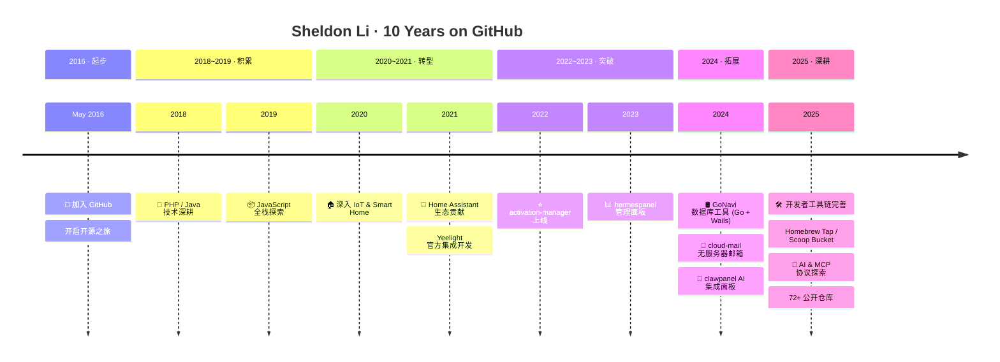

<div align="center">

<!-- 自托管 SVG 头图，不依赖外部服务 -->


[](https://git.io/typing-svg)

<br/>

<!-- 动态打字底部装饰线 -->


</div>

---

<!-- ═══════════════════ ABOUT ME ═══════════════════ -->

<div align="center">

### ✨ `whoami`

</div>

<table>
<tr>
<td width="60%">

```yaml
name:     Sheldon Li
alias:    xdlee
role:     Software Engineer @ Yeelight
location: 🇨🇳 China
blog:     https://xdlee.me
github:   Since May 2016 (~10 years)
repos:    72+ public repositories

focus:
  - 🏠 Smart Home & IoT Platform
  - 🤖 Home Assistant Ecosystem
  - 🛠 Developer Tools & Automation
  - ☁️  Cloud-Native Architecture

motto: "Talk is cheap. Show me the code."
```

</td>
<td width="40%" align="center">

<br/>

<!-- 个人统计徽章 -->

<br/><br/>

<br/><br/>

<br/><br/>


</td>
</tr>
</table>

---

<!-- ═══════════════════ TECH STACK ═══════════════════ -->

<div align="center">

### 🔥 `ls ~/tech-stack`

</div>

<table>
<tr>
<td valign="top" width="50%">

#### ⚡ Languages
```
█████████████████████  Python
████████████████       TypeScript
█████████████          JavaScript
████████████           Go
█████████              Java
████████               PHP
██████                 C++
```

</td>
<td valign="top" width="50%">

#### 🧰 Ecosystems
```
█ FastAPI / Django / Flask
█ Vue.js / React / Next.js
█ Node.js / Express / NestJS
█ Tailwind CSS / Ant Design
█ PostgreSQL / MySQL / Redis
█ Docker / K8s / Cloudflare
█ Home Assistant / MQTT
```

</td>
</tr>
</table>

<div align="center">


<br/>


<br/>


</div>

---

<!-- ═══════════════════ GITHUB STATS ═══════════════════ -->

<div align="center">

### 📊 `htop --user=axdlee`


<br/>


</div>

---

<!-- ═══════════════════ CONTRIBUTION ACTIVITY ═══════════════════ -->

<div align="center">

### 📈 `git log --contributions`

[](https://github.com/ashutosh00710/github-readme-activity-graph)

</div>

---

<!-- ═══════════════════ CONTRIBUTION SNAKE ═══════════════════ -->

<div align="center">

### 🐍 `contribution --snake`


</div>

---

<!-- ═══════════════════ WAKATIME ═══════════════════ -->

<div align="center">

### ⏱ `wakatime --stats`

<!--START_SECTION:waka-->
<!--END_SECTION:waka-->


</div>

---

<!-- ═══════════════════ FEATURED PROJECTS ═══════════════════ -->

<div align="center">

### 🚀 `ls ~/projects --featured`

</div>

<table>
<tr>
<td width="50%">

#### 🏆 activation-manager
> 软件激活码授权管理系统 — 快速构建软件付费服务

**TypeScript** · ⭐ 42 · 🔥 Most Starred

[](https://github.com/axdlee/activation-manager)

</td>
<td width="50%">

#### 📰 toutiao-publish
> 今日头条自动发布 — 长文章、图片上传、完整自动化流程

**Shell** · ⭐ 6

[](https://github.com/axdlee/toutiao-publish)

</td>
</tr>
<tr>
<td width="50%">

#### 📊 hermespanel
> 现代化管理面板

**TypeScript** · ⭐ 3

[](https://github.com/axdlee/hermespanel)

</td>
<td width="50%">

#### 🦀 clawpanel
> OpenClaw 可视化管理面板 — 内置 AI 助手，跨平台桌面应用

**JavaScript** · AI 多模态

[](https://github.com/axdlee/clawpanel)

</td>
</tr>
<tr>
<td width="50%">

#### 🛢 GoNavi
> 现代化原生数据库管理工具 — Go + Wails + React

**TypeScript** · 轻量高性能

[](https://github.com/axdlee/GoNavi)

</td>
<td width="50%">

#### 📧 cloud-mail
> 基于 Cloudflare 的邮箱服务 — 无服务器架构

**Cloudflare Workers**

[](https://github.com/axdlee/cloud-mail)

</td>
</tr>
<tr>
<td width="50%">

#### 🏠 ha_yeelight_pro
> Yeelight Pro Home Assistant 集成 — 支持云端和私有部署

**Python** · Yeelight Official · 核心贡献者

[](https://github.com/Yeelight/ha_yeelight_pro)

</td>
<td width="50%">

#### 🔄 anyrouter-check-in
> 多平台多账号签到工具 — 兼容 NewAPI/OneAPI 平台

**Python** · 自动化运维

[](https://github.com/axdlee/anyrouter-check-in)

</td>
</tr>
</table>

---

<!-- ═══════════════════ TIMELINE ═══════════════════ -->

<div align="center">

### 📅 `timeline --history`



</div>

---

<!-- ═══════════════════ CONNECT ═══════════════════ -->

<div align="center">

### 📫 `cat ~/.social-links`

[](https://xdlee.me)
[](https://github.com/axdlee)
[](https://x.com/LiXdlee110)
[](mailto:xdlee110@gmail.com)
[](https://linux.do/u/xdlee)


</div>

---

<!-- ═══════════════════ FOOTER ═══════════════════ -->

<div align="center">


<br/>

```
💬 "The best error message is the one that never shows up." — Thomas Fuchs
```

<br/>


</div>
