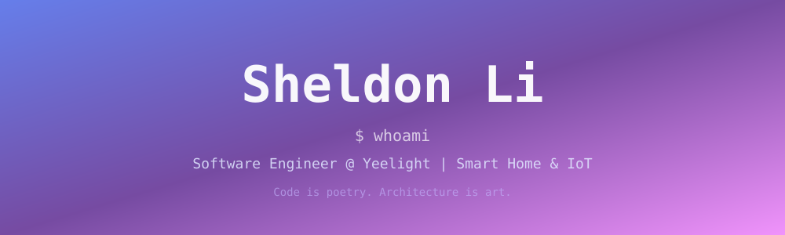
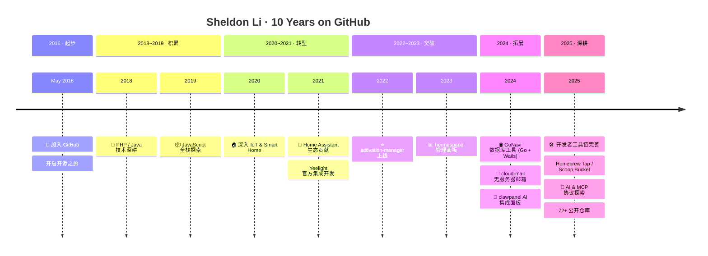

<div align="center">



[](https://git.io/typing-svg)

<br/>

<!-- 总览数字 -->


</div>

---

## 👋 About Me

<table>
<tr>
<td width="65%">

```yaml
name:     Sheldon Li
alias:    xdlee
role:     Software Engineer @ Yeelight
location: 🇨🇳 China
blog:     https://xdlee.me
github:   Since May 2016 (~10 years)
repos:    72+ public repositories

focus:
  - 🏠 Smart Home & IoT Platform
  - 🤖 Home Assistant Ecosystem
  - 🛠 Developer Tools & Automation
  - ☁️  Cloud-Native Architecture

motto: "Talk is cheap. Show me the code."
```

</td>
<td width="35%" align="center">


</td>
</tr>
</table>

---

## 🔥 Tech Stack

<table>
<tr>
<td valign="top" width="50%">

#### ⚡ Languages
```
█████████████████████  Python
████████████████       TypeScript
█████████████          JavaScript
████████████           Go
█████████              Java
████████               PHP
██████                 C++
```

</td>
<td valign="top" width="50%">

#### 🧰 Ecosystems
```
█ FastAPI / Django / Flask
█ Vue.js / React / Next.js
█ Node.js / Express / NestJS
█ Tailwind CSS / Ant Design
█ PostgreSQL / MySQL / Redis
█ Docker / K8s / Cloudflare
█ Home Assistant / MQTT
```

</td>
</tr>
</table>

<div align="center">


<br/>


<br/>


</div>

---

## 📊 GitHub Stats

<div align="center">


<br/>


</div>

---

## 📈 Contribution Activity

<div align="center">

[](https://github.com/ashutosh00710/github-readme-activity-graph)

</div>

---

## 🐍 Contribution Snake

<div align="center">

<picture>
  <source media="(prefers-color-scheme: dark)" srcset="https://raw.githubusercontent.com/axdlee/axdlee/output/github-contribution-grid-snake-dark.svg" />
  <source media="(prefers-color-scheme: light)" srcset="https://raw.githubusercontent.com/axdlee/axdlee/output/github-contribution-grid-snake-dark.svg" />
  
</picture>

</div>

---

## ⏱ Coding Stats

<div align="center">

<!--START_SECTION:waka-->

```txt
JavaScript                 26 hrs 45 mins        █████████████████░░░░░░░░   67.76 %
Markdown                   3 hrs 46 mins         ██▒░░░░░░░░░░░░░░░░░░░░░░   09.57 %
Go                         2 hrs 21 mins         █▒░░░░░░░░░░░░░░░░░░░░░░░   05.99 %
Python                     1 hr 54 mins          █▒░░░░░░░░░░░░░░░░░░░░░░░   04.82 %
JSON                       1 hr 35 mins          █░░░░░░░░░░░░░░░░░░░░░░░░   04.04 %
```

<!--END_SECTION:waka-->


</div>

---

## 🚀 Featured Projects

<div align="center">

<!-- 项目 1-2 -->
<a href="https://github.com/axdlee/activation-manager">
  
</a>
<a href="https://github.com/axdlee/toutiao-publish">
  
</a>

<!-- 项目 3-4 -->
<a href="https://github.com/axdlee/hermespanel">
  
</a>
<a href="https://github.com/axdlee/clawpanel">
  
</a>

<!-- 项目 5-6 -->
<a href="https://github.com/axdlee/GoNavi">
  
</a>
<a href="https://github.com/axdlee/cloud-mail">
  
</a>

<!-- 项目 7-8 -->
<a href="https://github.com/Yeelight/ha_yeelight_pro">
  
</a>
<a href="https://github.com/axdlee/anyrouter-check-in">
  
</a>

</div>

---

## 🏆 GitHub Achievements

<div align="center">

<!-- Pull Shark — 合并了 42+ 个 PR -->

<!-- Arctic Code Vault Contributor — 2020年活跃仓库归档 -->

<!-- Starstruck — 仓库获得 16+ stars -->

<!-- YOLO — 直接合并 PR 未经 review -->


</div>

<div align="center">


</div>

---

## ⭐ Star History

<div align="center">

<a href="https://star-history.com/#axdlee/activation-manager&Date">
  
</a>

</div>

---

## 📅 Timeline

<div align="center">



</div>

---

## 📫 Let's Connect

<div align="center">

[](https://xdlee.me)
[](https://github.com/axdlee)
[](https://x.com/LiXdlee110)
[](mailto:xdlee110@gmail.com)
[](https://linux.do/u/xdlee)


</div>

---

<div align="center">


<br/>

```
💬 "The best error message is the one that never shows up." — Thomas Fuchs
```

<br/>


</div>
