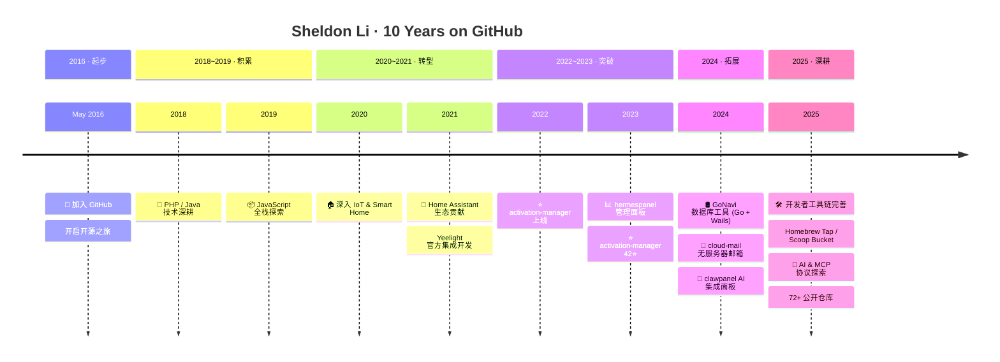

<div align="center">

<!-- ═══════════════════════════════════════════════════════════════════════════════════ -->
<!-- 头部：黑客风格终端横幅 -->
<!-- ═══════════════════════════════════════════════════════════════════════════════════ -->

```
 ███████╗██╗  ██╗███████╗██╗     ██████╗  ██████╗ ███╗   ██╗
 ██╔════╝╚██╗██╔╝██╔════╝██║     ██╔══██╗██╔═══██╗████╗  ██║
 █████╗   ╚███╔╝ █████╗  ██║     ██║  ██║██║   ██║██╔██╗ ██║
 ██╔══╝   ██╔██╗ ██╔══╝  ██║     ██║  ██║██║   ██║██║╚██╗██║
 ███████╗██╔╝ ██╗███████╗███████╗██████╔╝╚██████╔╝██║ ╚████║
 ╚══════╝╚═╝  ╚═╝╚══════╝╚══════╝╚═════╝  ╚═════╝ ╚═╝  ╚═══╝
```

<!-- 打字动画 -->
[](https://git.io/typing-svg)

<br/>

<!-- ASCII 艺术分割线 -->


</div>

<!-- ═══════════════════════════════════════════════════════════════════════════════════ -->
<!-- 关于我 -->
<!-- ═══════════════════════════════════════════════════════════════════════════════════ -->

##  `cat ~/.about`

```yaml
name:     Sheldon Li
alias:    xdlee
role:     Software Engineer @ Yeelight
location: 🇨🇳 China
blog:     https://xdlee.me
github:   Since May 2016 (~10 years)
repos:    72+ public repositories

focus:
  - 🏠 Smart Home & IoT Platform
  - 🤖 Home Assistant Ecosystem
  - 🛠 Developer Tools & Automation
  - ☁️  Cloud-Native Architecture

philosophy:
  - "Talk is cheap. Show me the code." — Linus Torvalds
  - "Simplicity is the soul of efficiency." — Austin Freeman
```

<div align="center">


</div>

---

<!-- ═══════════════════════════════════════════════════════════════════════════════════ -->
<!-- 技术栈 -->
<!-- ═══════════════════════════════════════════════════════════════════════════════════ -->

##  `ls ~/tech-stack`

<table>
<tr>
<td valign="top" width="50%">

#### ⚡ Languages
```
█████████████████████  Python
████████████████       TypeScript
█████████████          JavaScript
████████████           Go
█████████              Java
████████               PHP
██████                 C++
```

</td>
<td valign="top" width="50%">

#### 🧰 Ecosystems
```
█ FastAPI / Django / Flask
█ Vue.js / React / Next.js
█ Node.js / Express / NestJS
█ Tailwind CSS / Ant Design
█ PostgreSQL / MySQL / Redis
█ Docker / K8s / Cloudflare
█ Home Assistant / MQTT
```

</td>
</tr>
</table>

<div align="center">

<!-- 语言徽章 - 行 1 -->


<!-- 技术栈徽章 - 行 2 -->


</div>

---

<!-- ═══════════════════════════════════════════════════════════════════════════════════ -->
<!-- GitHub 数据统计 -->
<!-- ═══════════════════════════════════════════════════════════════════════════════════ -->

##  `htop --user=axdlee`

<div align="center">

<!-- 核心统计卡片 -->


<br/>

<!-- 连续贡献统计 -->


</div>

---

<!-- ═══════════════════════════════════════════════════════════════════════════════════ -->
<!-- 贡献活动图 -->
<!-- ═══════════════════════════════════════════════════════════════════════════════════ -->

##  `git log --contributions`

<div align="center">

### 📊 Contribution Activity Graph
[](https://github.com/ashutosh00710/github-readme-activity-graph)

</div>

---

<!-- ═══════════════════════════════════════════════════════════════════════════════════ -->
<!-- 贡献蛇形动画 -->
<!-- ═══════════════════════════════════════════════════════════════════════════════════ -->

### 🐍 Contribution Snake

<div align="center">

<!-- 需要通过 GitHub Actions 自动生成，先放占位图，推送后配置 Actions 即可生效 -->
<!-- 配置方法见 README 底部说明 -->


> ⚠️ 首次需配置 GitHub Actions 自动生成，详见底部说明

</div>

---

<!-- ═══════════════════════════════════════════════════════════════════════════════════ -->
<!-- 编码时长统计 (WakaTime) -->
<!-- ═══════════════════════════════════════════════════════════════════════════════════ -->

##  `wakatime --stats`

<!-- WakaTime 编码时长统计 — GitHub Actions 每日自动更新 -->
<!-- WAKATIME_API_KEY 已配置 ✅ -->

<div align="center">


> 安装 [WakaTime 编辑器插件](https://wakatime.com/plugins) 后数据自动采集，Actions 每日自动更新

</div>

---

<!-- ═══════════════════════════════════════════════════════════════════════════════════ -->
<!-- 精选项目 -->
<!-- ═══════════════════════════════════════════════════════════════════════════════════ -->

##  `ls ~/projects --featured`

<table>
<tr>
<td width="50%">

### 🏆 activation-manager
> 软件激活码授权管理系统 — 快速构建软件付费服务

**TypeScript** · ⭐ 42 · 🔥 Most Starred

[](https://github.com/axdlee/activation-manager)

</td>
<td width="50%">

### 📰 toutiao-publish
> 今日头条自动发布 — 长文章、图片上传、完整自动化流程

**Shell** · ⭐ 6

[](https://github.com/axdlee/toutiao-publish)

</td>
</tr>
<tr>
<td width="50%">

### 📊 hermespanel
> 现代化管理面板

**TypeScript** · ⭐ 3

[](https://github.com/axdlee/hermespanel)

</td>
<td width="50%">

### 🦀 clawpanel
> OpenClaw 可视化管理面板 — 内置 AI 助手，跨平台桌面应用

**JavaScript** · AI 多模态集成

[](https://github.com/axdlee/clawpanel)

</td>
</tr>
<tr>
<td width="50%">

### 🛢 GoNavi
> 现代化原生数据库管理工具 — Go + Wails + React

**TypeScript** · 轻量高性能

[](https://github.com/axdlee/GoNavi)

</td>
<td width="50%">

### 📧 cloud-mail
> 基于 Cloudflare 的邮箱服务 — 无服务器架构

**Cloudflare Workers**

[](https://github.com/axdlee/cloud-mail)

</td>
</tr>
<tr>
<td width="50%">

### 🏠 ha_yeelight_pro
> Yeelight Pro Home Assistant 集成 — 支持云端和私有部署

**Python** · Yeelight Official · 核心贡献者

[](https://github.com/Yeelight/ha_yeelight_pro)

</td>
<td width="50%">

### 🔄 anyrouter-check-in
> 多平台多账号签到工具 — 兼容 NewAPI/OneAPI 平台

**Python** · 自动化运维

[](https://github.com/axdlee/anyrouter-check-in)

</td>
</tr>
</table>

---

<!-- ═══════════════════════════════════════════════════════════════════════════════════ -->
<!-- 成就 & 奖杯 -->
<!-- ═══════════════════════════════════════════════════════════════════════════════════ -->

##  `achievements --list`

<div align="center">

[](https://github.com/axdlee)

</div>

---

<!-- ═══════════════════════════════════════════════════════════════════════════════════ -->
<!-- 时间线 -->
<!-- ═══════════════════════════════════════════════════════════════════════════════════ -->

##  `timeline --history`

<div align="center">



</div>

---

<!-- ═══════════════════════════════════════════════════════════════════════════════════ -->
<!-- 联系方式 -->
<!-- ═══════════════════════════════════════════════════════════════════════════════════ -->

##  `cat ~/.social-links`

<div align="center">

[](https://xdlee.me)
[](https://github.com/axdlee)
[](https://x.com/LiXdlee110)
[](mailto:xdlee110@gmail.com)
[](https://linux.do/u/xdlee)

</div>

<div align="center">

<!-- 微信 -->


</div>

---

<!-- ═══════════════════════════════════════════════════════════════════════════════════ -->
<!-- 页脚 -->
<!-- ═══════════════════════════════════════════════════════════════════════════════════ -->

<div align="center">

### 💬 Dev Quote of the Day

[](https://github.com/piyushsuthar/github-readme-quotes)

<br/>


<br/>

<!-- 底部 ASCII 艺术 -->
```
 ╔═══════════════════════════════════════════════════════╗
 ║  "The best error message is the one that never shows  ║
 ║   up." — Thomas Fuchs                                 ║
 ╚═══════════════════════════════════════════════════════╝
```


</div>

<!-- ═══════════════════════════════════════════════════════════════════════════════════ -->
<!-- 配置说明（不会在 Profile 中显示，仅作为参考） -->
<!-- ═══════════════════════════════════════════════════════════════════════════════════ -->

<!--
=== 📋 后续激活模块配置说明 ===

## 1. 🐍 Snake 动画（贡献蛇）
   - 仓库: https://github.com/Platane/snk
   - 已配置 .github/workflows/snake.yml
   - 推送后进入 Actions → "Generate Snake" → Run workflow 即可

## 2. ⏱ WakaTime 编码统计
   - ✅ WAKATIME_API_KEY 已配置
   - ✅ wakatime.yml 已就绪
   - 需安装编辑器插件: https://wakatime.com/plugins
   - 推送后进入 Actions → "Update WakaTime Stats" → Run workflow

## 3. 📊 贡献活动图
   - 已通过 GitHub API 自动读取，无需额外配置
-->
